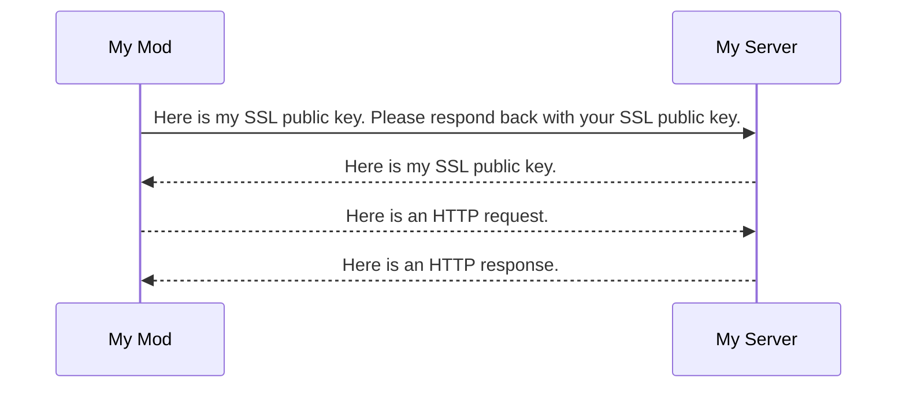
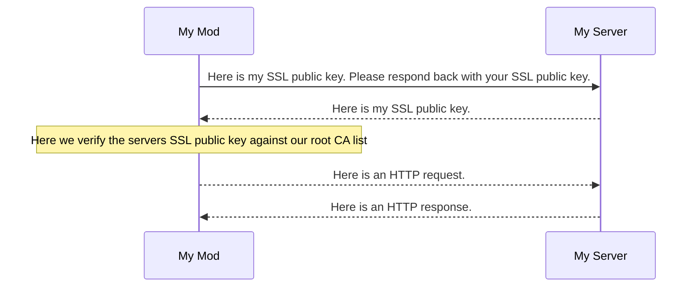

# Web Requests and HTTPS

Sooner or later you might want to interact with the Web from your mod.

Normal methods of making HTTP requests work, this is still Java after all.
There are however some pitfalls.

## Our subject of study

Think of a command like this:


```java
@Override
public void processCommand(ICommandSender sender, String[] args) {
  try {
    URL url = new URL("https://some-leaderboard-api.nea.moe/getleaderboardposition?username=" + args[0]);
    JsonObject apiResponse = gson.fromJson(url.openStream(), JsonObject.class);
    sender.addChatMessage(new ChatComponentText("§a" + args[0] + " is rank #" + apiResponse.get("rank").getAsInt()));
  } catch (Exception e) {
    throw new RuntimeException(e);
  }
}
```

This will work, but it has a few problems. There are a few smaller problems (like not checking for missing arguments, not handling http failures, not handling invalid JSON), but the one big problem is blocking requests.

Whenever you make an HTTP request, it will take some time to complete that request. During that time other code is blocked from running, since it needs to wait on data from that HTTP request. In this example `:::java gson.fromJson(...)` will wait until the HTTP request is completed, since the returned JsonObject needs that data.

This is an issue, since Minecraft is waiting on your command to complete before it can continue working, meaning while that HTTP request is running, you cannot render any new frames, cannot handle any input, and you cannot handle any of the servers packets, meaning you can even time out on longer requests. The solution to this is threads.

## Threads

A thread allows you to basically create another mini program inside of your existing program. A thread can run at the same time as all your other code, but because it is a thread instead of another program, it can access some of the same data.


```java
@Override
public void processCommand(ICommandSender sender, String[] args) {
  Thread thread = new Thread(() -> {
    try {
      URL url = new URL("https://some-leaderboard-api.nea.moe/getleaderboardposition?username=" + args[0]);
      JsonObject apiResponse = gson.fromJson(url.openStream(), JsonObject.class);
      sender.addChatMessage(new ChatComponentText("§a" + args[0] + " is rank #" + apiResponse.get("rank").getAsInt()));
    } catch (Exception e) {
      throw new RuntimeException(e);
    }
  });
  thread.start();
}
```

In Java, the `:::java new Thread(...)` constructor allows you to create a new thread. You pass in a lambda that gets run inside that new `Thread` as soon as you call `:::java thread.start()`.

Running this command now no longer blocks your game. All the processing and waiting of the network request is done on another `Thread`, so the main Minecraft thread can run freely.


### Thread safety

Threads aren't all sunshines and roses however. One thing you might notice is your game occasionally crashing after you run your command. You get a `ConcurrentModificationException` from the chat window. Maybe you just notice some inconsistent data that comes from a network request. All this comes from one basic issue. Two threads can run at the same time, therefore two threads can access and modify the same data at the same time.

Let's look at a simpler example. In this code snippet the two functions `threadA` and `threadB` are run by different threads at the same time.

```java
String someSharedVariable = "hello";

void threadA() {
  someSharedVariable = doCalculation(someSharedVariable);
}

void threadB() {
  someSharedVariable = doCalculation(someSharedVariable);
}
```

If we run `threadA` and `threadB` in a conventional program, we would expect `doCalculation` to be called twice:

```java

void runInConventionalProgram() {
  threadA();
  threadB();
  // This above is equivalent to
  someSharedVariable = doCalculation(doCalculation(someSharedVariable));
}
```

However, ran with threads, the statements intermingle. `threadA` and `threadB` might both access the shared variable at the start, getting the initial value. Both apply the calculation to that same initial value. `threadB` finishes first and saves the calculation result in the variable. `threadA` finishes second and overwrites `threadB`s calculations with its new result. This becomes even more complicated when different threads do different calculations.

In order to make threads work, we need something called synchronization. Only one thread can access the same data at the same time, or things get problematic.

!!! note
    Keep in mind that this does not just apply to direct variable access. Calling a function which then later on accesses a variable or a field in a variable will still cause the same issues.

!!! note
    There are of course exceptions. Some classes and objects have internal synchronization built in, specifically built to support multiple threads accessing them, but most classes will break if you access or modify them from multiple threads at the same time. In fact even simple variable access can (silently) break, as demonstrated above.

### Synchronization

Synchronization blocks a thread while another thread is accessing the same data as it. This is not done automatically, but instead needs to be explicitly specified. Synchronizing is done on an object (not on the name of that object, but that exact instance). If you are inside of a `:::java synchronized (someObject)` block you are said to be "holding *that objects* lock".

```java

Object lockObject = new Object();

String someSharedVariable;


void threadA() {
  String localVariable = doSomeCalculation();
  doSomeExpensiveAndSlowNetworkCall();
  synchronized (lockObject) {
    someSharedVariable = doSomeCalculationWithTheSharedVariable(localVariable, someSharedVariable);  
  }
  doSomeMoreCalculation(localVariable);
}
```

A few notes:

 - the first `doSomeCalculation` call is not synchronized. If you access `someSharedVariable` here there will be no guarantees over other threads accessing it.
 - the `:::java synchronized` block needs an argument. In this case i pass in `lockObject`, *not* `someSharedVariable`. This is because `:::java synchronized (x)` will only work if `x` is never changed. You can change things *inside* of the locked variable (so `x.b = 10;` is okay), but replacing the entire variable with a new one (like we are doing with `:::java someSharedVariable = /*...*/`) would mean that we are synchronizing against a completely different object, which will therefore not be synchronized with other threads.
   If you want to synchronize a variable across threads that you want to change out entirely, you should have a second lock object you never change.

 - Once i finish the synchronized block i should no longer access the `someSharedVariable`. After i end that block, other threads can access the object.
 - I do the expensive operations *outside* of the `:::java synchronized` block. If you hold the lock on an object all other threads that want to lock on the same object will wait, so doing a network request (for example) while holding a lock will result in those other threads waiting, which is exactly the thing we wanted to avoid by using threads.
 - I lock on a variable that i made up. `:::java synchronized` blocks only ever matter if *all* the code accessing that variable use those same blocks. If other code just accesses that variable without synchronizing first, then your synchronization does not matter at all.

Synchronization is a necessary tool, and often the most efficient/performant way of doing things, but it is quite complicated, and it does not work if you want to access Minecrafts variables, since Minecraft does not do any `synchronized` blocks itself.

So if synchronization does not work or is too complicated, we can instead do something else: Just work on one thread.

### Callbacks

Expensive calculations need to be done on other threads. Stalling out Minecraft every time you want to look up some bazaar data in the background is not okay if it kicks you out of whatever server you are on, and also freezes the entire game. But since most things you want to do with network requests end up with displaying some version of that newly gotten info to the player, we also need to get back info into the main thread. This can be done either by synchronizing on a variable with the reply and waiting in a (synchronized) tick event to check for that variables contents, or you can use callbacks.

Minecraft has a function called `:::java Minecraft.getMinecraft().addScheduledTask()`. This function takes in a `:::java Runnable`, which is a lambda of the form `:::java () -> {}`. This lambda will be called on the main thread in the next tick. You can call this function from your thread in order to call Minecrafts functions safely. Keep in mind that this new code will run on the Minecraft main thread, meaning that you should not access data from your other thread, unless you know that other thread won't change the variable anymore, or are properly synchronizing it.

```java
@Override
public void processCommand(ICommandSender sender, String[] args) {
  Thread thread = new Thread(() -> {
    try {
      URL url = new URL("https://some-leaderboard-api.nea.moe/getleaderboardposition?username=" + args[0]);
      JsonObject apiResponse = gson.fromJson(url.openStream(), JsonObject.class);
      Minecraft.getMinecraft().addScheduledTask(() -> {
        sender.addChatMessage(new ChatComponentText("§a" + args[0] + " is rank #" + apiResponse.get("rank").getAsInt()));
      });
    } catch (Exception e) {
      throw new RuntimeException(e);
    }
  });
  thread.start();
}
```

In this example all minecraft code (aside from `addScheduledTask`, which is specifically designed to work when accessed from another thread) is only accessed from the main minecraft thread, but all of our calculation is done inside of a worker thread.


### More on threading

Threads are necessary, but they are also clumsy and hard to work with. There are ways to mitigate this, using `CompletableFuture` and utility methods and events. There are also things about threading that i am skimming over here. There are easier to synchronize primitives (for example `List`s that automatically synchronize) and thread pools, but those are all complicated and nuanced and also not Minecraft specific. Threading is a really complex topic, and even my very basic overview here probably has some mistakes already, so i urge you to seek out other tutorials on it, if you plan on doing complicated threading work.

## SSL

After all that ordeal with threading you probably are hoping that you are done, but sadly there is another problem. Running your code inside of your development environment is fine, but some of your users report issues when running the game normally. After a while of debugging you find the root cause: Java somehow thinks that the https server has an invalid certificate.

### Certificates and how does SSL work

!!! note
    This section explains how SSL works and why we need to do what we need to do. If you just want to fix SSL issues, you can skip this rather technical section.

!!! note
    This section intentionally oversimplifies things such as key exchanges, signing vs encryption, private/public key, TLS handshakes, certificate chains and more in order to provide some limited understanding (as is applicable to a minecraft mod), without requiring much effort.

HTTPS works using something called TLS, which is a newer form of SSL. For most purposes (including this text) SSL and TLS can be used interchangibly. SSL encrypts everything inside of your HTTPS request in accordance with an SSL public key so that only the corresponding SSL private key can decrypt the data. This works both ways, so both sides of the exchange have a private and a public key that they use so that only the other person can read any of the data in transit.



Solid lines are unencrypted, dashed lines are encrypted. [Note that this diagram is intentionally oversimplified and **wrong**](https://en.wikipedia.org/wiki/TLS_handshake).

One problem you might notice is that even tho all the interesting communication is encrypted, nothing prevents an evil actor to just pretend to be the server, intercepting our first message and replacing it with their own fake SSL public key. This way they can read all of our messages. One way to fix this is using certificates.

In our client we have a list of so called "root certificate authorities" (root CA). These are essentially just public keys that we *trust* to be good. Since we don't want to store a public key for every website, we just store those few root CAs. Then, in addition to their public key, every website we visit also sends along a signature for their public key, essentially an encryption using the root CAs public key that can cryptographically only be done by someone with that root CAs private key (some signature schemes operate differently, but the basic idea is the same. You have some way of mathematically proving that the certificate was signed in some way by someone in your root CA list).



Obviously an evil root CA can still be a problem, but a lot of attacks can be prevented this way.

### Root CAs in Java

Java comes with a list of root CAs (certificate authority), basically a list of signatures that can be used to verify if you want to trust a website. Whenever you make an HTTPS request Java checks the connection against that list of CAs, and throws an error if it cannot trust that website. By default Java is fairly up to date and adds new root CAs whenever they become officially/widely accepted.

However, the java version used by the default minecraft launcher is quite old. Java version 1.8u51 to be exact. Your IDE probably uses a newer version of Java, probably something around ~1.8u400. In between those many versions new root CAs get added, so it is quite easy to not notice if a website will not be trusted by the normal minecraft launcher.

Now how do we fix this?

#### Avoiding the problem altogether

There are two easy (almost code less) fixes. Use an older certificate authority that has been around for a while, or use a more modern Java version. Note that a lot of those older CAs may charge a fee, and even when using an old provider, there is no guarantee that they will give you a certificate signed with one of their older root CAs. Maybe you also want to access a website you don't have access to (like GitHub or the Hypixel API). Also getting all your users to change the default minecraft java installation is a challenge so obvious, I hope I don't have to explain to anyone.

#### False hope

There are two ways that I see often used to fix this problem. Just using HTTP and disabling the CA trusting mechanism altogether. Both of them allow anyone to access all of the data that is being transmitted. For something simple as bazaar data that might be fine, but even if there is nothing private or secretive you need to be careful. If (for example) you are disabling HTTPS for your update checker, it is quite easy for a malicious actor to inject a fake update, making them download a potentially malicious binary that will be executed on the next startup.

In fact disabling HTTPS or the CA root mechanisms is considered so bad of a practice that all major browsers have a mechanism called [HSTS](https://en.wikipedia.org/wiki/HTTP_Strict_Transport_Security) which allows websites to prevent accessing them via HTTP.

I will call out some mods here that I know are doing this.

 - [Partly Sane Skies](https://github.com/PartlySaneStudios/partly-sane-skies/blob/4d4eb0f30d52e74762439b2114f09c13af166819/src/main/kotlin/me/partlysanestudios/partlysaneskies/data/api/Request.kt#L116)
 - [Skyblock-Tweaks](https://github.com/MrFast-js/Skyblock-Tweaks/blob/0ff4f55a268a875645848958d07f910a480a5736/src/main/java/mrfast/sbt/utils/NetworkUtils.kt#L33)
 - [Bazaar Notifier](https://github.com/symt/BazaarNotifier/blob/988b2728538c45aba6ca3f240c3c718b8608fd12/src/main/java/dev/meyi/bn/utilities/Utils.java#L43-L59)
 - and many more...

The mods listed here only use them for minor requests, but some others out there use them for their updater notifications, potentially allowing attackers to run arbitrary code on their users computer. If you would like to add or remove from that list, feel free to [make an issue](https://github.com/nea89o/modDevWiki/issues/new?title=[SSL%20Violator%20List]).

Some mods go even further beyond and not only use those broken trust factories for their own mods request, but also set them as the global default, making the requests done by all other mods also be insecure.

For obvious reasons, I won't tell you how to set up these custom trust chain checkers and I am urging you to never use HTTP over HTTPS for anything remotely sensitive.

#### Bringing your own certificates

The nice thing about Java is that, while it does not have all the modern certificates built in, you can just ship your own. This is a bit involved, but it allows you to make HTTPS requests seamlessly and without security issues. You can even add your own root CA, in case you don't want to use any of the existing root CAs (but I won't teach you how to do that here).

Generally when using Java, you store your certificates inside of a key store. So let's first create our custom key store. If possible, you should be using an old JDK (1.8u51) for this. You will also need a new JDK that you want to take the keys from. The JKS default formats have changed a bit throughout the years, and while they all should roughly be compatible with each other, it helps if we create the file with an old JDK.

Every keystore in java needs a password. By default the password is `changeit` whenever you download a JDK. Don't change that password.


```bash
YOUR_OLD_JDK/bin/keytool -importkeystore -srckeystore YOUR_NEW_JDK/lib/security/cacerts -destkeystore mykeystore.jks
```

This will prompt you for a password for your destination keystore. You should just keep it as "changeit", since that is the default for all java keystores that do not store secret information. This new `mykeystore.jks` file now needs to be added to your `src/main/resources` folder. Add it to that folder directly, instead of the `assets` folder like with other resources. Feel also free to rename it to something else including your mod id.

Now we come to using this certificate in your code. First you need to load your new keystore: 

```java
static SSLContext ctx;
static {
  try {
    KeyStore myKeyStore = KeyStore.getInstance("JKS");
    // Change SomeClass to be the class you are currently in
    // The resource name needs to be prefixed with a /
    // The password should be changeit, unless you are using a different password for your keystore (but you shouldn't)
  	myKeyStore.load(SomeClass.class.getResourceAsStream("/mykeystore.jks"), "changeit".toCharArray());
  	KeyManagerFactory kmf = KeyManagerFactory.getInstance(KeyManagerFactory.getDefaultAlgorithm());
  	TrustManagerFactory tmf = TrustManagerFactory.getInstance(TrustManagerFactory.getDefaultAlgorithm());
  	kmf.init(myKeyStore, null);
  	tmf.init(myKeyStore);
    ctx = SSLContext.getInstance("TLS");
    ctx.init(kmf.getKeyManagers(), tmf.getTrustManagers(), null);
  } catch (KeyStoreException | NoSuchAlgorithmException | KeyManagementException | UnrecoverableKeyException |
				 IOException | CertificateException e) {
	  System.out.println("Failed to load keystore. A lot of API requests won't work");
	  e.printStackTrace();
	  ctx = null;
  }
}
```

This should be done only once, and you can store this `:::java SSLContext` in a static variable.

Now, whenever you make an HTTPs request, you simply set the requests context to that SSL context:

```java
static SSLContext ctx;
static {
  // That code from earlier
}
public static URLConnection openHTTPSConnection(URL url) throws Exception {
  URLConnection connection = url.openConnection();
  if (connection instanceof HttpURLConnection && ctx != null) {
    ((HttpURLConnection) connection).setSSLSocketFactory(ctx.getSocketFactory());
  }
  return connection;
  // Or you can return an input stream directly:
  // return connection.getInputStream();
}
```


So with all this, how does our final HTTPS request look like:

```java
@Override
public void processCommand(ICommandSender sender, String[] args) {
  Thread thread = new Thread(() -> {
    try {
      URL url = new URL("https://some-leaderboard-api.nea.moe/getleaderboardposition?username=" + args[0]);
      JsonObject apiResponse = gson.fromJson(SSLUtil.openHTTPSConnection(url).getInputStream(), JsonObject.class);
      Minecraft.getMinecraft().addScheduledTask(() -> {
        sender.addChatMessage(new ChatComponentText("§a" + args[0] + " is rank #" + apiResponse.get("rank").getAsInt()));
      });
    } catch (Exception e) {
      throw new RuntimeException(e);
    }
  });
  thread.start();
}
```

There is still lots to improve here, and you will probably write your own utility methods to make this easier, but the basic structure will boil down to something roughly looking like this.


